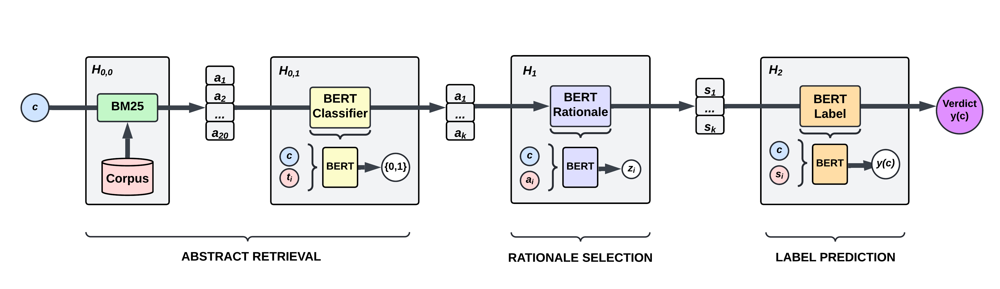

# **`SciFCheX: Developing a Scientific Fact-Checker with Hybrid Evidence Retrieval Approaches`** 📟

> [!NOTE]
> This is the official public release of the `SciFCheX`, scientific fact-checking pipeline, authored by Filip J. Cierkosz. This research project has been pursued in completion of the *BSc Computer Science* degree at the <a href="https://www.sheffield.ac.uk/">University of Sheffield</a> as a final-year project, which achieved a high-marked distinction. The development version of this project (which contains approx. 500 commits) will remain private. The introduced scientific verification pipeline consists of: *evidence retrieval*, *rationale selection*, and *label prediction* stages. Please note that this project was particularly focused on experimenting with novel approaches associated with the first stage of the pipeline, i.e., *evidence retrieval*. On top of that, the presented solution addresses the `SCIVER` shared task, and has been submitted to its [official leaderboard](https://leaderboard.allenai.org/scifact/submissions/) hosted by Allen AI that can be found here. The project ranked in TOP 50 worldwide submissions at the time of its publication. More descriptions about the performance can be found in [this section](#performance-).

## **Table of Contents** 📖

- [Project Structure](#project-structure-)
- [Approach](#approach-)
- [Performance](#performance-️)
- [Dependencies & Experimental Environment](#dependencies--experimental-environment-)
- [Abstract Retrieval](#abstract-retrieval-)
- [Pipeline](#pipeline-)
- [Training](#training-)
- [Contribution](#contribution-)

## **Project Structure** 🔎

The section contains brief clarifications about the project resources that can be found within this repository. It is strongly advised to visit individual files for further context about implementations, since each of them has been annotated with quite a comprehensive amount of documentation:
- `.github` - Standard `git` setup that contains `PR template`, `workflows`, etc.
- `data` - Full copy of the `SciFact` dataset from the paper titled "[Fact or Fiction: Verifying Scientific Claims](https://arxiv.org/abs/2004.14974)" by *Wadden et al. (2020)*. The dataset contains 1,409 samples provided with a corpus of 5,183 abstract documents. The data was used for training and evaluations of the presented pipeline.
- `pipeline` - The full-implementation of the `SciFCheX` system, which consists of the following packages:
    - `eval` - Implements the `AbstractRetrievalEvaluator` and `PipelineEvaluator` classes and their respective `tools`. This toolkit is essential to evaluate the model performance on different levels of complexity.
    - `inference` - Handles the pipeline flow when running predictions at inference time. It consists of: `abstract_retieval -> rationale_selection -> label_prediction`. Notably, the `abstract_retrieval` package contains all retrieval implementations tested during this research (i.e., `TF-IDF`, `BM25`, `BM25 + BGE-M3`, `BM25 + BERT`, `BM25 + SciBERT`, `BM25 + BioBERT`).
    - `training` - Includes the `PyTorch` implementation for the training of `abstract retrieval` (only for `BERT`-based retrieval settings), `rationale selection`, and `label prediction`, and their associated `tools`.
- `results` - The directory stores all the experimental results obtained from different experiments. These are automatically created by `eval` package, whenever evaluation is completed. `results/abstract_retrieval` contains AR-only experimental results, whereas `results/pipeline` has the ones for full-pipeline runs.
- `resources` - Contains project related resources, e.g., images.
- `script` - Implements all essential `BASH` scripts that can be used to run, e.g., abstract retrieval, pipeline, training, etc. All these can be run with different settings through specifying `CLI args`. Please follow the next sections of this `README` to find out more, or refer to `script/` files to explore their respective documentation.

## **Approach** 🧠



As briefly mentioned earlier, the `SciFCheX` pipeline follows the popular multi-step pipeline approach: *evidence retrieval* (referred as *abstract retrieval*), *rationale selection*, and *label prediction*. A high-level purpose of such a system can be analyzed in the image above. To clarify again - this fact verification system is specifically tailored to scientific claims.

---

The task addressed by `SciFCheX` can be defined as provided in the `SCIVER` shared task description *(Wadden et al., 2021)*:

*Given a valid scientific claim, the task is to (1) identify all abstracts in the corpus that are relevant to the claim, (2) label the relation of each relevant abstract to the claim as either "SUPPORTS" or "REFUTES", and (3) identify a set of evidentiary sentences (i.e. rationales) to justify each label.*

---

While developing the final pipeline for `SciFCheX`, the experiments included experimenting with the following approaches:
- For `abstract retrieval`:
    - 2 different sparse methods: `TF-IDF`, `BM25`.
    - 4 different hybrid retrieval approaches (i.e., sparse + dense retrieval): `BM25 + BGE-M3`, `BM25 + BERT`, `BM25 + SciBERT`, `BM25 + BioBERT-base`; where: all `BERT`-based approaches involved fine-tuning a classifier on the `train` set of `SciFact` dataset.
- For `rationale selection`: the approaches involved utilizing `RoBERTa-large`, `SciBERT`, `BioBERT-base`, `BioBERT-large`; where: each transformer was fine-tuned on `SciFact` only.
- For `label prediction`: similarly as the line above, the approaches involved testing `RoBERTa-large`, `SciBERT`, `BioBERT-base`, `BioBERT-large` transformers; where: each transformer was fine-tuned on `SciFact`; in addition - there was tested a version of `RoBERTa-large` from `VERISCI` *(Wadden et al., 2020)*, that was pre-trained on `FEVER` and further fine-tuned on `SciFact` by the authors of that model.

---

**Thus, the most optimal settings concluded for the `SciFCheX` pipeline consists of:**
- `AR`: `BM25 + SciBERT` classifier fine-tuned on `SciFact`. More about `AR` training can be found [in this file](https://github.com/chizo4/SciFCheX/blob/main/pipeline/training/ar_transformer_scifact.py).
- `RS`: `SciBERT` transformer fine-tuned on `SciFact` to select rationales. More about `RS` training can be found [in this file](https://github.com/chizo4/SciFCheX/blob/main/pipeline/training/rs_transformer_scifact.py).
- `LP`: `RoBERTa-large` transformer fine-tuned on `FEVER+SciFact`; this model was accessed from `VERISCI` resources, since this project did not include fine-tuning on `FEVER` (due to computational limitations associated with the scope of this project).

## **Performance** 🏎️

`Abstract Retrieval`: The following table reports the results for all tested approaches, evaluated on the `dev` set of `SciFact`. The best performing `AR` approach in isolation, i.e., `BM25 + BioBERT-base` is annotated respectively. Still, the full-pipeline uses `SciBERT`, since it was found to perform better when integrated into the full-pipeline.

| Approach |   F1   | Precision | Recall | Hit-one | Hit-all |
|----------|--------|-----------|--------|---------|---------|
| `TFIDF` (K=3) **[VERISCI]**    |  0.26  |   0.16    |  0.69  |   0.85  |   0.83  |
| `BM25` (K=3)    |  0.29  |   0.18    |  0.78  |   0.90  |   0.88  |
| `BM25` (K=20) + `BGE-M3`   |  0.52  |   0.40    |  **0.76**  |   **0.90**  |   **0.88**  |
| `BM25` (K=20) + `BERT`     |  0.66  |   0.80    |  0.56  |   0.74  |   0.72  |
| `BM25` (K=20) + `SciBERT` **[SCIFCHEX]**  |  0.72  |   0.82    |  0.64  |   0.79  |   0.77  |
| `BM25`(K=20) + `BioBERT-base`  |  **0.73**  |   **0.86**    |  0.63  |   0.78  |   0.76  |

---

`Pipeline`: The following tables report full-pipeline performance of `SciFChex` compared with the official `VERISCI` model, run on `dev` set of `SciFact`. Full results for different setups can be found in `results/PIPELINE_DEV.txt` (merged file), and in `results/pipeline/` directory.

1. `SciFCheX` (`AR: BM25 + SciBERT`, `RS: SciBERT`, `LP: RoBERTa-large`) results on `dev`:

|          | Sentence Selection | Sentence Label | Abstract Label-only | Abstract Rationalized |
|----------|--------------------|----------------|---------------------|-----------------------|
| Precision|                0.79|            0.72|                0.86 |                  0.82 |
| Recall   |                0.46|            0.42|                0.49 |                  0.46 |
| F1       |                **0.59**|            **0.53**|                **0.62** |                  **0.59** |

2. `VERISCI` (`AR: TF-IDF`, `RS: RoBERTa-large`, `LP: RoBERTa-large`) results on `dev`:

|          | Sentence Selection | Sentence Label | Abstract Label-only | Abstract Rationalized |
|----------|--------------------|----------------|---------------------|-----------------------|
| Precision|                0.53|            0.47|                0.56 |                  0.53 |
| Recall   |                0.44|            0.39|                0.47 |                  0.45 |
| F1       |                0.48|            0.43|                0.51 |                  0.49 |

---

Overall, it can be observed that the improvements applied to `evidence retrieval` lead to major improvements in the full-pipeline performance, which was further confirmed in the official [SCIVER Shared Task Leaderboard](https://leaderboard.allenai.org/scifact/submissions/public), where the individual `SCIFCHEX` report can be found [here](https://leaderboard.allenai.org/scifact/submission/cp4hdtfitdc6sv0kle60). At the time of the model submission (i.e., in early May 2024), `SCIFCHEX` placed in TOP 50 submissions worldwide.

## **Dependencies & Experimental Environment** 🧪

> [!WARNING]
> The presented `SciFCheX` model has been tested, trained and evaluated using `NVIDIA A100 GPU` / `NVIDIA L4 GPU` using `Google Colab Pro+` account. The initial development attempts involved working on `HPC` unit provided by the *University of Sheffield* (running on `CentOS Linux`), but there were issues associated with `CUDA` compatibility issues in relation to `torch` version required for this project (`1.7.0`). Thereby, it is recommended to use `CUDA 11.1.X` to run this project. Moreover, it is worth noting that the model is unlikely to successfuly execute on other `OS`, such as: `Windows`, or `macOS` (NB: the `ARM` architecture on `macOS` might not support dependencies for `requirements_scifchex.txt`).

1. **Clone Repository:**
   Clone the repository and access it through the following commands (NB: Skip the step if you were provided with the code base. Just make sure you navigate inside the root of the projet):

   ```bash
   git pull https://github.com/chizo4/SciFCheX.git && cd SciFCheX
   ```

2. **GPU Activation:**
   Before you move further make sure your `GPU` device is available. It's up to you to make sure it's activated, since different `GPU` require different setup. At the same time, it might be different if you run the model on `HPC` unit, which might require you to submit a job, rather than run it interactively. As noted earlier, this project was developed on `NVIDIA A100`. Once `GPU` resource is accessed/activated, make sure you use `CUDA 11.1.X`. It can be verified through:

   ```bash
   nvcc --version
   ```

3. **Check `conda` Version:**
   Next, ensure you have `conda` installed on your machine. You can verify its installation by checking its version:

   ```bash
   conda --version
   ```

   > [!WARNING]
   > If your shell fails to recognize the command (which is very unlikely if you are a computer scientist), please install `conda` following the official guidelines: [conda docs](https://conda.io/projects/conda/en/latest/user-guide/install/index.html).

4. **Environment Setup:**
   The project has been provided with an automation file, that will set up all the necessary environments without further supervision:

   ```bash
   bash ./SciFCheX/script/env-setup.sh
   ```

## **Abstract Retrieval** 📑

> [!NOTE]
> Each approach implemented for this stage can be found in `pipeline/inference/abstract_retrieval` directory. In addition, the implemented evaluation can be found in `pipeline/eval/abstract_retrieval_evaluator.py`. The evaluation script both prints the results at the end of the cell execution and saves it into path `SciFCheX/results/abstract_retrieval`.

---

Having completed all the configuration steps, it is finally the time to explore the capabilities of this project. The command below runs the custom-made script, that can be found in `SciFCheX/script/abstract-retrieval.sh`. It allows you to execute different `retrieval` approaches tested in this research project.

---

The `AR` script works in the following way:

```shell
bash ./script/abstract-retrieval.sh [retrieval] [dataset] [run_eval]
```

Where the options can be defined as:

- `[retrieval]` ➡️ `biobert` (best-performing approach), `scibert`, `bert`, `bge_m3`, `bm25`, `tfidf`.

- `[dataset]` ➡️ `dev` (recommended), `test` (skips evaluation, since no labels), `train` (please avoid using for `BERT` retrievals, as these models were fine-tuned on it and so their scores will be close to perfection).

- `[run_eval]` ➡️ `true` (shows evaluation results), `false` (skips evaluation).

---

❗The configuration provided below is set to run the best-performing `retrieval` developed in this project. Namely, it uses the `HYBRID` approach of first finding `K=20` best matching docs with `BM25`, that are further classified by the `SciBERT` transformer model, fine-tuned on `train` set of the `SciFact` dataset.

```shell
bash ./script/abstract-retrieval.sh scibert dev true
```

## **Pipeline** ✅

> [!NOTE]
> Each approach implemented for full-pipeline can be found in `pipeline/inference/` directory, which contains `abstract_retrieval`, `rationale_selection`, and `label_prediction` packages for predictions. In addition, the implemented evaluation can be found in `pipeline/eval/pipeline_evaluator.py` and its respective `tools` package. The evaluation script both prints the results at the end of the cell execution and saves it into path `results/pipeline`.

---

Now, it is the time to test the performance of the whole pipeline! The command in the next cell executes the custom-made script, that can be found in `script/pipeline.sh`. It makes it possible to run the pipeline for different `abstract retrieval` settings combined with different `rationale selection` and `label prediction` modules.

---

The script command works in the following way:

```shell
bash ./script/pipeline.sh [retrieval] [model] [dataset]
```

Where the options can be defined as:

- `[retrieval]` ➡️ As specified in `Abstract Retrieval`. In addition, can run `oracle`, which directly passes the gold selection into `RS` / `LP` stages (i.e., it imitates a "perfect" retrieval scenario).

- `[model]` ➡️ `scifchex` (for `SciFCheX`), `baseline` (for a `VERISCI` replica developed by FJC), `verisci` (for the actual `VERISCI` model from `Allen AI`).

- `[dataset]` ➡️ `dev` (recommended), `test` (skips evaluation, since no labels), `train` (please avoid using for `BERT` retrievals, as these models were fine-tuned on it and so their scores will be close to perfection).

---

The configuration provided below is set to run the best-performing `SciFCheX` pipeline, which consists of:
- `Abstract Retrieval`: Uses the aforementioned `HYBRID` approach that first finds `K=20` best matching docs with `BM25`, that are further classified by the `SciBERT` transformer model, fine-tuned on train set of the `SciFact` dataset.
- `Rationale Selection`: Uses a `SciFact` fine-tuned `SciBERT` model.
- `Label Prediction`: Uses a `FEVER+SciFact` fine-tuned `RoBERTa-large` model (provided by `VERISCI` authors).

```shell
bash ./script/pipeline.sh scibert scifchex dev
```

# **Training** 🔥

> [!NOTE]
> This is just a brief insight about training approaches. In reality, it required much deeper exploration, including different `epochs` settings etc. Similarly as in other stages, FJC automated everything to the highest level of details to make the solution as efficient as possible. All the training implementation and its tools can be found in `pipeline/training` directory.

---

> [!WARNING]
> Running any of the scripts below on a free version of a notebook might take several hours, or might even directly fail, due to lack of memory on the `T4 GPU`. FJC used `NVIDIA A100` and `NVIDIA L4` GPUs for training all of the modules.

---

The `AR` stage required training for the following settings: `biobert`, `scibert`, `bert`. Notably, `bge_m3` setting was used without any fine-tuning. Unsuprisingly, the sparse approaches, such as: `tfidf`, `bm25`, did not required training.

`AR` training can be executed via:

```shell
bash script/train-abstract-retrieval.sh [model]
```

Where the `[model]` option can be defined as:
- `bert`: For `BERT`.
- `scibert`: For `SciBERT`.
- `biobert_base`: For `BioBERT-base` (best performing in isolation).

---

The `RS` stage required training for all transformers.

`RS` training can be executed via:

```shell
cd SciFCheX/ && bash script/train-rationale-selection.sh [model]
```

Where the `[model]` option can be defined as:
- `scibert`: For `scibert` (best performing).
- `biobert_large`: For `BioBERT-large`.
- `biobert_base`: For `BioBERT-base`.
- `roberta_large`: For `RoBERTa-large`.

---

The `LP` stage required training for all transformers.

`LP` training can be executed via:

```shell
cd SciFCheX/ && bash script/train-label-prediction.sh [model]
```

Where the `[model]` option can be defined as:
- `scibert`: For `scibert`.
- `biobert_large`: For `BioBERT-large`.
- `biobert_base`: For `BioBERT-base`.
- `roberta_large`: For `RoBERTa-large`.

## Contribution 🤝

> [!NOTE]
> In case you had questions associated with this project, or spotted any issue (including experimental setup), please feel free to contact Filip J. Cierkosz via any of the links included on [this GitHub page](https://github.com/chizo4). You might also want to open a `Pull Request` with any suggested fixes, or questions.
